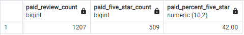

# Amazon Vine Analysis

## Purpose

The purpose of this analysis was to determine if there is a positive rating bias for paid reviewers using the vine program, compared to organic reviewers for products in the kitchen category on Amazon.com.

## Results

### Unpaid Review Data

These two tables summarize the for both unpaid and paid reviewers. The following conclusions can be drawn from the data.

- There are two orders of magnitude more unpaid reviewers than paid reviewers.

- The ratio of 5-star reviews to total reviews is relatively close for both datasets, however paid vine reviewers rated products less than 5-stars slightly more often than the unpaid reviewers. 

## Summary

It seems the data suggests there is no positivity bias for reviewers using the vine porgram, at least when it comes to kitchen products. In fact, it could be suggested that reviewers who are paid to write reviews feel a responsibility to be more critical of products in order to ensure consumers know exactly what they are getting. 

To broaden this study, I think it would be interesting to also look at the rates of 1, 2, 3, and 4 star reviews. Are vine reviewers more likely to rate a product with a 1-star compared to unpaid reviewers? Or are unpaid reviewers more likely to rate a product at the extremes of 1 and 5 stars? Paid reviewers may feel a responsibilty to provide a more nuanced review and thus utilize 2, 3 and 4 stars more often. Whereas unpaid reviewers may simply be thinking 1 or 5 stars, as in recommend or don't recommend.
